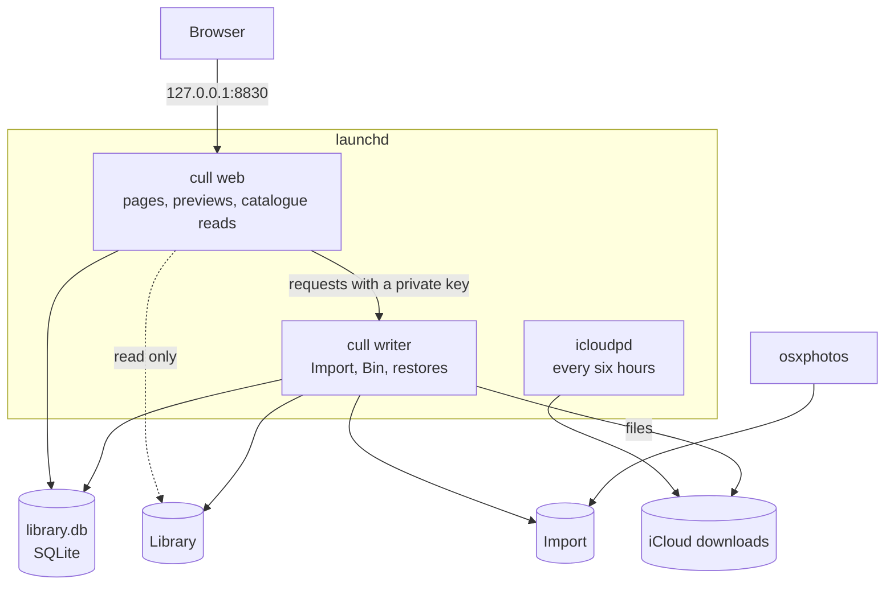

# Daddy, Cull!

[](https://github.com/tural-ali/daddy-cull/actions/workflows/go.yml)
[](https://github.com/tural-ali/daddy-cull/actions/workflows/web.yml)
[](https://github.com/tural-ali/daddy-cull/actions/workflows/mac.yml)
[](https://github.com/tural-ali/daddy-cull/actions/workflows/docker.yml)
[](https://github.com/tural-ali/daddy-cull/releases)
[](LICENSE)

A free photo and video organiser for years of accumulated memories.
Bring your files together in one library on your own disk, then review today's date across every year: keep what matters and remove what doesn't.

It runs on a Mac (macOS 14 or newer) as a local app with a browser interface, or on a server or NAS with Docker.
Website: [daddy-cull.turalali.com](https://daddy-cull.turalali.com)


## Quick start

On a Mac, paste this into Terminal:

```bash
curl -fsSL https://raw.githubusercontent.com/tural-ali/daddy-cull/main/install.sh | bash
```

The current release is a beta.
The installer checks your Mac, installs what it needs, and opens setup in your browser at [http://127.0.0.1:8830/setup](http://127.0.0.1:8830/setup).
On a server, see [docs/SERVER.md](docs/SERVER.md).

## Why I built it

I had 20 years of photos and videos, more than 60,000 files, spread across Apple Photos, Google Photos and Lightroom.
They were stored in plenty of places, but there was no complete local copy I controlled, and cleaning up one app left the others full.
Daddy Cull is the one place where photos are brought together and culled, before anything else is done with them.
The [first blog post](https://turalali.com/giving-my-60-000-photos-and-videos-a-system/) tells the longer story.

## Every day

Open [http://127.0.0.1:8830](http://127.0.0.1:8830), or run `daddy-cull open`.

1. **Review today's date.** Today shows every photo and video taken on this date, in every year, so years of memories become manageable daily sessions. <kbd>K</kbd> keeps, <kbd>X</kbd> removes, <kbd>F</kbd> favourites and <kbd>⌘Z</kbd> undoes.
2. **Mark the date reviewed.** The Year calendar fills in, and a reviewed date that gains new files gets a red dot until they are decided.
3. **Let new photos arrive.** Drop in a camera card, or let iCloud, Apple Photos and Google Photos fill the Import folder. Each file is filed under the day it was taken, in `YYYY/YYYY-MM/YYYY-MM-DD`.

Every page has a short guide at the top, and <kbd>?</kbd> lists every key.


| Page | What it is for |
|---|---|
| **Today** | Every photo and video taken on this date, in every year. Mark the date reviewed when done. |
| **Year** | A calendar of every date with photos, how far you have got, and a red dot on dates with new arrivals. |
| **Duplicates** | Byte-identical copies of a file in different folders, found by comparing full hashes, and copies of a video whose pictures and sound are identical but whose metadata differs, such as the same clip downloaded twice. Re-encoded, trimmed or edited videos and similar-looking shots are not duplicates here. Pick the copy to keep; the rest go to the Bin. |
| **Apple Photos** | Carries what you removed and favourited across to the Photos app, and so to iCloud, once you press Apply. Removals go to Recently Deleted. Optional. |
| **Log** | Every decision, newest first. A removal can be undone while the file is still in the Bin. |
| **Bin** | Everything removed, restorable until the Bin retention period set in Settings ends. |
| **Addons** | Turn features on or off, or add your own. |
| **Settings** | Folders, Immich, Jellyfin, the Bin retention period, theme and version. |


<details>
<summary>More screenshots</summary>


</details>

## Safety

- The library is plain folders on your own disk, in a layout any app can read. Back it up like any other folder, so a second copy lives somewhere else.
- Nothing is overwritten. A file the library already holds, byte for byte, is set aside in `Import/Already in the library` for you to check.
- Nothing is deleted without passing through the Bin, and the Bin checks every file's SHA-256 fingerprint again before it moves it.
- Removed files can be restored from the Bin or the Log until the Bin retention period ends. After that they are deleted for good.
- Apple Photos changes only when you say so: nothing changes until you press Apply, macOS asks you to confirm, and removals go to Recently Deleted in Photos.
- Only the private writer process changes the library; the web process only reads it.
- Daddy Cull listens on `127.0.0.1` only and has no login, so it is for the person at this Mac.

## Install

### Requirements

| | Minimum |
|---|---|
| macOS | 14 Sonoma or newer |
| Processor | Apple silicon or Intel |
| Memory | 4 GB |
| Free space | 2 GB for the app, plus room for your photos |
| Network | Internet during installation (github.com) |
| Port | 8830 free on this Mac (set `DADDY_CULL_PORT` to use another) |
| Account | Your own user, not `sudo` |

There are no tools to install beforehand: the installer sets up the dependencies.
It installs Homebrew if it is missing, and Homebrew's installer asks for your Mac password.

### What the installer does

1. Checks this Mac against the requirements above, and finds the release. If either falls short, it changes nothing.
2. Downloads the release and checks its checksum.
3. Installs Homebrew if it is missing, then exiftool and ffmpeg (dates, RAW previews, video frames) and uv.
4. Asks whether to install icloudpd (iCloud) and osxphotos (Apple Photos). Both are optional.
5. Starts Daddy Cull in the background with launchd, and opens the setup wizard.

Running it again, or `daddy-cull update`, updates Daddy Cull and keeps its settings.
The running version is stopped only once the new one is downloaded and checked.
If the new version does not start, the one before it is put back and started again, and the version before the current one is kept.

| Option | What it does |
|---|---|
| `--with-icloud` / `--without-icloud` | Install icloudpd, or skip it without asking |
| `--with-apple-photos` / `--without-apple-photos` | Install osxphotos, or skip it without asking |
| `--library DIR` | The library folder (default `~/Pictures/Daddy Cull/Library`) |
| `--import DIR` | The Import folder (default `~/Pictures/Daddy Cull/Import`) |
| `--release VERSION` | Install a specific release, such as `0.72.0` |
| `--yes` | Ask nothing; iCloud and Apple Photos stay off unless asked for |
| `--no-open` | Do not open the browser at the end |
| `--update` | Keep the settings and install the new version |

Pass options after `bash -s --`, for example:

```bash
curl -fsSL https://raw.githubusercontent.com/tural-ali/daddy-cull/main/install.sh | bash -s -- --library "/Volumes/Photos/Library" --with-icloud
```

Releases are signed ad hoc, not notarised by Apple.
The installer downloads with `curl`, so macOS does not quarantine the app.

### The setup wizard

The wizard runs in the browser and can be reopened any time from Settings.


| Step | What you choose |
|---|---|
| Welcome | Checks exiftool, ffmpeg, icloudpd, osxphotos and free space |
| Folders | Where the library and the Import folder live, and whether other users of this Mac may open them |
| iCloud | Whether to download iCloud Photos every six hours, from which Apple ID and since when |
| Apple Photos | Whether to copy photos from the Photos app on this Mac into Import |
| Google Photos | A folder for Google Takeout exports |
| Done | What runs from now on |

## The `daddy-cull` command

| Command | What it does |
|---|---|
| `daddy-cull status` | What is running, where the folders are, what is installed |
| `daddy-cull open [page]` | Open Daddy Cull in the browser, such as `daddy-cull open setup` |
| `daddy-cull start`, `stop`, `restart` | Control the background services |
| `daddy-cull logs` | Follow what the services write |
| `daddy-cull icloud install` | Install icloudpd |
| `daddy-cull icloud sign-in` | Sign in to iCloud in this Terminal, with two-factor code |
| `daddy-cull icloud run` | Download new photos now (it also runs every six hours) |
| `daddy-cull apple-photos install` | Install osxphotos |
| `daddy-cull apple-photos import` | Copy new photos from Apple Photos into Import |
| `daddy-cull update` | Install the latest release |
| `daddy-cull uninstall` | Remove the app; your photos and catalogue stay |

## Sources and integrations

**Camera cards and phones.**
Copy the files into the Import folder.
Within a minute each one is filed under the day it was taken: from its metadata, read by exiftool, or else its name or file date.

**iCloud Photos.**
Turn it on in the wizard's iCloud step, then run `daddy-cull icloud sign-in` once.
Apple asks you to sign in again about every two months; the setup's iCloud step and Settings say when.
Photos stay in iCloud: this is a copy you own.

**Apple Photos on this Mac.**
Turn it on in the wizard's Apple Photos step, or run `daddy-cull apple-photos import`.
macOS asks once for permission to read the Photos library.

**Google Photos.**
Google offers no API to download a whole library, so Daddy Cull reads [Google Takeout](https://takeout.google.com) exports.
Choose only Google Photos, `.zip`, 50 GB parts, and save the parts in the folder chosen in the wizard.
The Google Photos page then shows what is new, what differs and what the library already has.

**Immich, Jellyfin and friends.**
Daddy Cull needs nothing else to run.
Because the library is plain folders, Immich, Jellyfin, Plex or Finder can all read it as an external library.
If you use Immich, give its address and an API key with the `asset.update` permission under Immich in Settings, and favourites you set in Daddy Cull are set there too.
If you use Jellyfin, give its address and an API key under Jellyfin in Settings, and Jellyfin scans again a minute after files are moved to the Bin, put back or deleted, so it stops showing videos that are gone.

### Built-in addons

Each is off until it is set up unless the table says otherwise:

| Addon | What it does | Set up in |
|---|---|---|
| Google Photos | Adds what a Google Takeout export holds and the library lacks | The setup wizard |
| Apple Photos | Carries removals and favourites across to the Photos app when you press Apply | The setup wizard |
| Immich | Sets the favourites you choose in Immich too | Settings |
| Jellyfin | Has Jellyfin scan again when files leave the library or come back | Settings |
| Library totals | Shows in the sidebar how many photos and videos there are and how much space they take | On from the start |

Screenshots, Saved from social, Takeout upgrades and Shadowed copies serve libraries moved from a NAS, where a report made there is imported first; see [how it works](docs/HOW-IT-WORKS.md#for-libraries-moved-from-a-nas).

## Troubleshooting

| Problem | Fix |
|---|---|
| The page does not open | `daddy-cull status`, then `daddy-cull restart` |
| Nothing is filed from Import | Check the Import folder on the Settings page; files still being copied wait until they stop changing |
| A library on an external drive shows nothing | Add `~/Library/Application Support/Daddy Cull/app/current/bin/cull` to Full Disk Access in System Settings, Privacy & Security, then `daddy-cull restart` |
| The library is in Downloads, Desktop or Documents | macOS guards those folders; choose another, such as `~/Pictures` |
| iCloud stopped downloading | `daddy-cull icloud sign-in` |
| Port 8830 is taken | Reinstall with `DADDY_CULL_PORT=8860` in front of `bash` |

Logs are in `~/Library/Application Support/Daddy Cull/logs`, and `daddy-cull logs` follows them.

## Development

You need Go 1.27 with a C compiler and Node 24.

```bash
go test ./...
cd web && npm ci && npm run build && npm test
```

`go run ./cmd/cull -db state/scale.db -seed 100000` makes a synthetic catalogue to try the interface on.
Versions are counted from the history by `tools/version.sh`: each `feat:` commit raises the minor version and each `fix:` the patch.
A green `main` is released automatically as a beta.

### Architecture



The app is one Go binary with a React interface, run as two launchd services.
Settings live in `~/Library/Application Support/Daddy Cull`.
Read [how it works](docs/HOW-IT-WORKS.md) for the details, [the architecture](docs/ARCHITECTURE.md) for the design, and [addons](docs/ADDONS.md) to write your own.
To run it on a server or NAS with Docker instead, see [docs/SERVER.md](docs/SERVER.md).

## Credits

Daddy Cull stands on the shoulders of these projects:

- [icloud_photos_downloader](https://github.com/icloud-photos-downloader/icloud_photos_downloader) (icloudpd) downloads iCloud Photos.
- [osxphotos](https://github.com/RhetTbull/osxphotos) exports from the Apple Photos library.
- [ExifTool](https://exiftool.org) by Phil Harvey reads when each photo was taken.
- [FFmpeg](https://ffmpeg.org) draws video and HEIC previews.

## Licence

[MIT](LICENSE)
