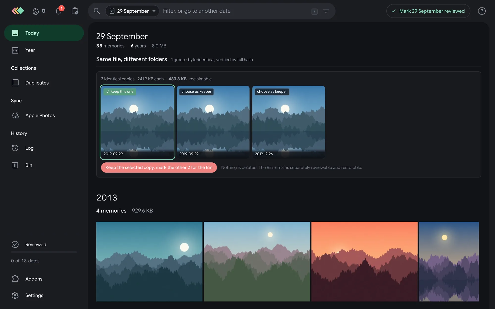
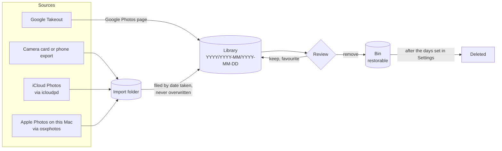
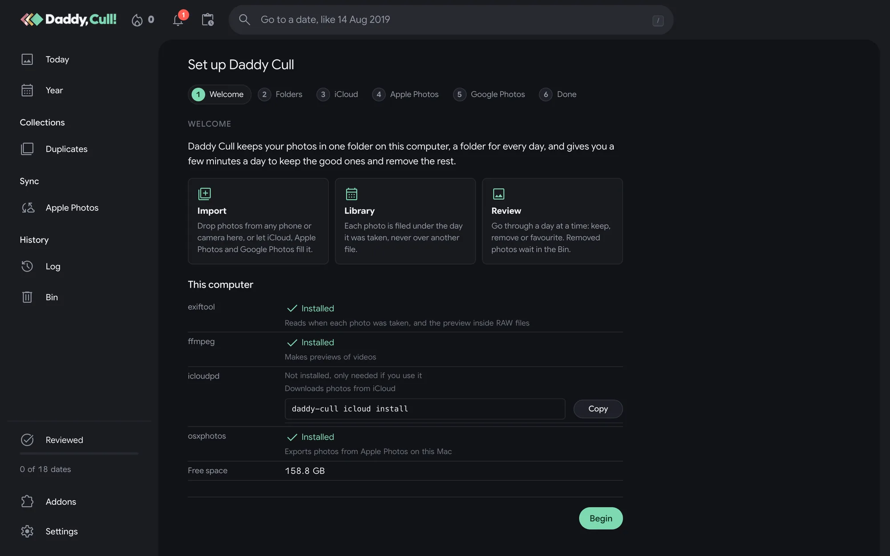
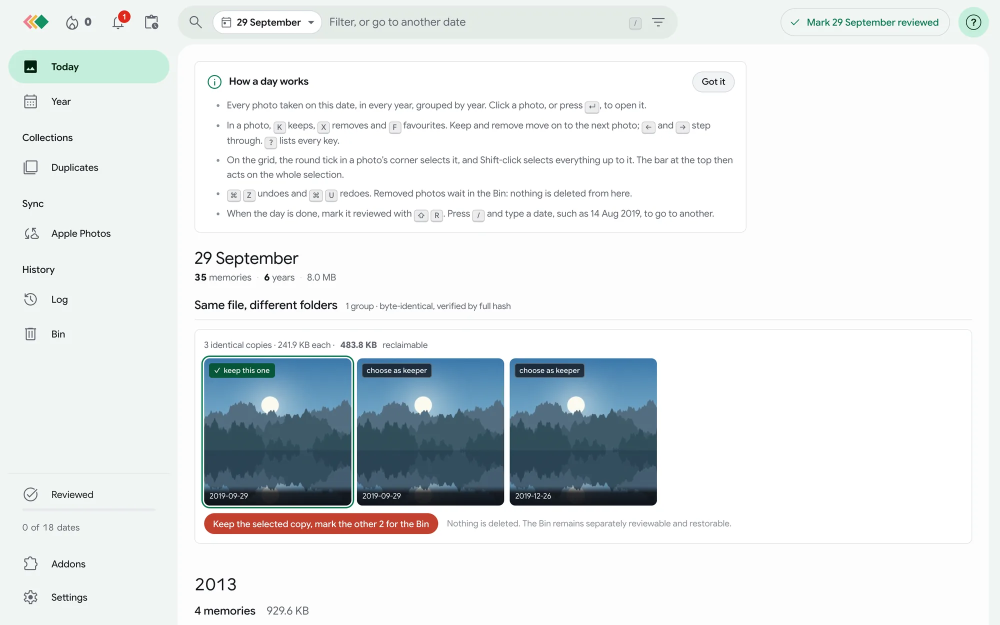
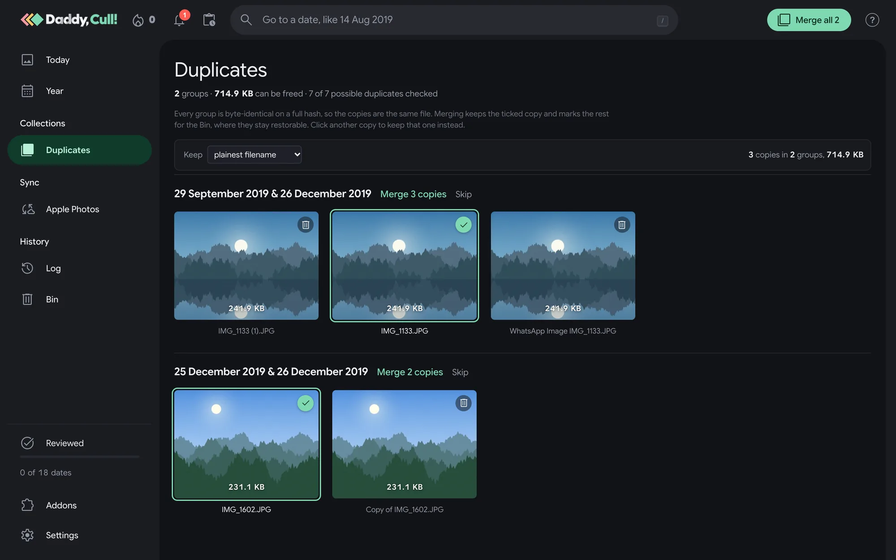
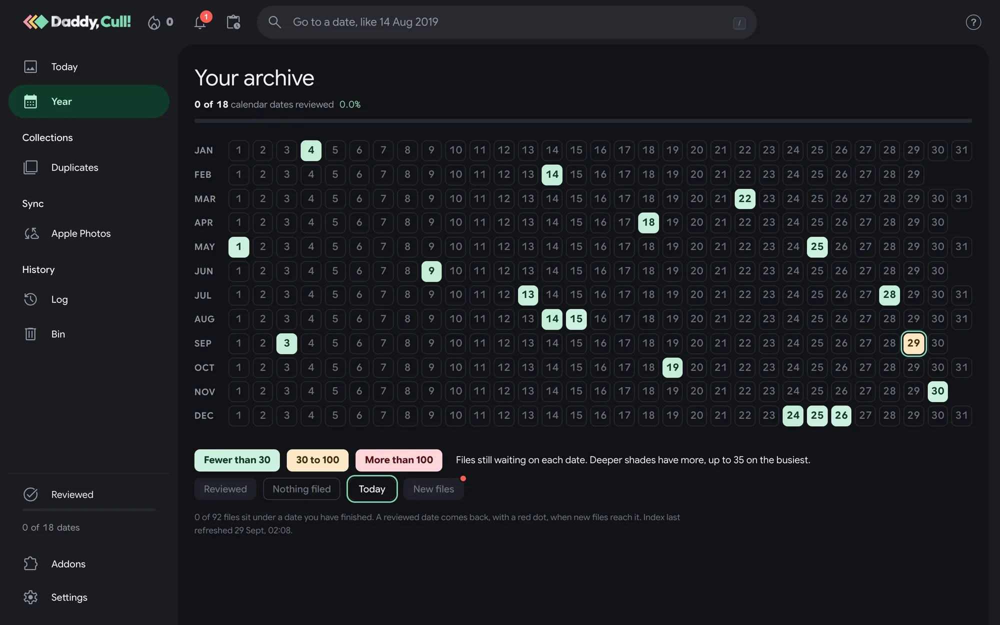
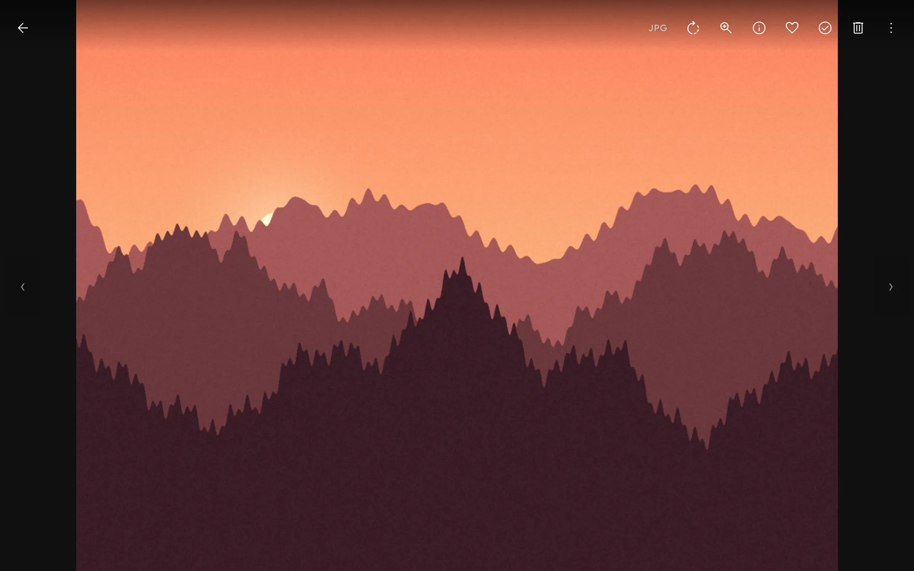
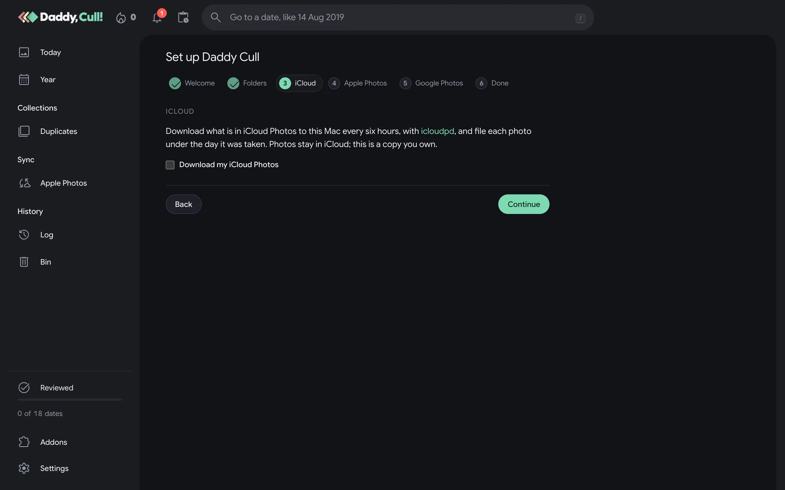
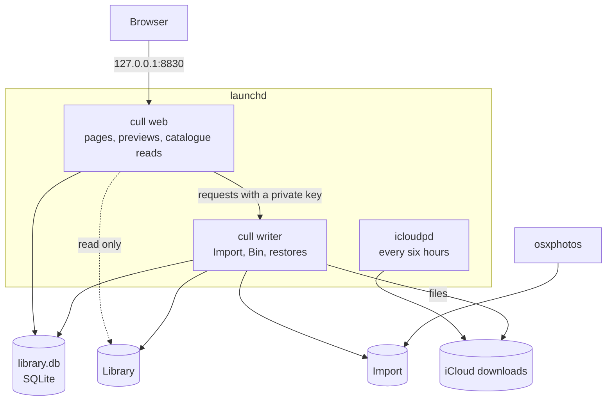

# Daddy, Cull!

[](https://github.com/tural-ali/daddy-cull-oss/actions/workflows/go.yml)
[](https://github.com/tural-ali/daddy-cull-oss/actions/workflows/web.yml)
[](https://github.com/tural-ali/daddy-cull-oss/actions/workflows/mac.yml)
[](https://github.com/tural-ali/daddy-cull-oss/actions/workflows/docker.yml)
[](https://github.com/tural-ali/daddy-cull-oss/releases)
[](LICENSE)

One place on your Mac to bring every photo in, file it by the day it was taken, and throw out the rest a few minutes a day.



## Why

### What?

I had 20 years of photos and videos, around 60,000 files, that needed cleaning up: duplicates of every kind, and plain trash.

### And what?

Every time our family of four came back from an event, there were hundreds of new photos, taken on different devices: iPhones, DSLR cameras and more.
Cleaning them up meant a number of different applications, one for each job.

### So what?

Daddy Cull is the one and only place to organise photos, before anything else is done with them.

1. **Clean up the old library every day.** Today shows every photo taken on this date, in every year, so 20 years become 365 short sessions.
2. **Import the photos taken day by day, and set a regular time to cull them.** Drop in a camera card, or let iCloud, Apple Photos and Google Photos fill the Import folder.
3. **Organise everything by date.** Every photo lands in `YYYY/YYYY-MM/YYYY-MM-DD`, in plain folders.

Above all, the library is local.
It is vendor agnostic, in a layout any app can read, and if one of the clouds vanishes some day, the files are still here.

## How it works



The library is a plain folder tree, the same shape as a family archive on a NAS:

```text
Library/
├── 2013/
│   └── 2013-09/
│       └── 2013-09-29/
│           ├── IMG_0412.JPG
│           └── IMG_0412.MOV      ← Live Photo halves stay together
└── 2025/
    └── 2025-09/
        ├── 2025-09-28/
        └── 2025-09-29/
            ├── DSC_1180.NEF
            └── IMG_5531.HEIC
```

Photos are never overwritten: a file the library already holds, byte for byte, is set aside in `Import/Already in the library` for you to check.
Removing a photo moves it to the Bin, and it can be restored from the Bin or the Log until the Bin's grace period ends.

## Requirements

| | Minimum |
|---|---|
| macOS | 14 Sonoma or newer |
| Processor | Apple silicon or Intel |
| Memory | 4 GB |
| Free space | 2 GB for the app, plus room for your photos |
| Network | Internet during installation (github.com) |
| Port | 8830 free on this Mac (set `DADDY_CULL_PORT` to use another) |
| Account | Your own user, not `sudo` |

The installer checks all of these first and changes nothing if one fails.
You do not need Docker, Homebrew, Python or anything else: the installer brings what is missing.

## Install

Paste this into Terminal:

```bash
curl -fsSL https://raw.githubusercontent.com/tural-ali/daddy-cull-oss/main/install.sh | bash
```

It will:

1. Check this Mac against the requirements above.
2. Install Homebrew if it is missing, then exiftool and ffmpeg (dates, RAW previews, video frames) and uv.
3. Download the latest release and check its checksum.
4. Ask whether to install icloudpd (iCloud) and osxphotos (Apple Photos). Both are optional.
5. Start Daddy Cull in the background with launchd, and open the setup wizard at [http://127.0.0.1:8830/setup](http://127.0.0.1:8830/setup).

| Option | What it does |
|---|---|
| `--with-icloud` / `--without-icloud` | Install icloudpd, or skip it without asking |
| `--with-apple-photos` / `--without-apple-photos` | Install osxphotos, or skip it without asking |
| `--library DIR` | The library folder (default `~/Pictures/Daddy Cull/Library`) |
| `--import DIR` | The Import folder (default `~/Pictures/Daddy Cull/Import`) |
| `--release VERSION` | Install a specific release, such as `0.72.0` |
| `--yes` | Ask nothing; iCloud and Apple Photos stay off unless asked for |
| `--no-open` | Do not open the browser at the end |
| `--update` | Keep the settings and install the new version |

Pass options after `bash -s --`, for example:

```bash
curl -fsSL https://raw.githubusercontent.com/tural-ali/daddy-cull-oss/main/install.sh | bash -s -- --library "/Volumes/Photos/Library" --with-icloud
```

### The setup wizard

The wizard runs in the browser and can be reopened any time from Settings.



| Step | What you choose |
|---|---|
| Welcome | Checks exiftool, ffmpeg, icloudpd, osxphotos and free space |
| Folders | Where the library and the Import folder live, and whether other users of this Mac may open them |
| iCloud | Whether to download iCloud Photos every six hours, from which Apple ID and since when |
| Apple Photos | Whether to copy photos from the Photos app on this Mac into Import |
| Google Photos | A folder for Google Takeout exports |
| Done | What runs from now on |

## Every day

Open [http://127.0.0.1:8830](http://127.0.0.1:8830), or run `daddy-cull open`.
Every page has a short guide at the top, and <kbd>?</kbd> lists every key.



| Page | What it is for |
|---|---|
| **Today** | Every photo taken on this date, in every year. <kbd>K</kbd> keeps, <kbd>X</kbd> removes, <kbd>F</kbd> favourites, <kbd>⌘Z</kbd> undoes. Mark the day reviewed when done. |
| **Year** | A calendar of every day with photos, how far you have got, and a red dot on days with new arrivals. |
| **Duplicates** | Byte-identical copies across folders. Pick the one to keep; the rest go to the Bin. |
| **Apple Photos** | Carries what you removed across to the Photos app, so iCloud drops it too. Optional. |
| **Log** | Every decision, newest first, each one reversible. |
| **Bin** | Everything removed, restorable until the grace period set in Settings ends. |
| **Addons** | Turn features on or off, or add your own. |
| **Settings** | Folders, Immich, Jellyfin, the Bin's grace period, theme and version. |

Built-in addons, each off until it is set up:

| Addon | What it does | Set up in |
|---|---|---|
| Google Photos | Adds what a Google Takeout export holds and the library lacks | The setup wizard |
| Apple Photos | Carries removals and favourites across to the Photos app | The setup wizard |
| Immich | Sets the favourites you choose in Immich too | Settings |
| Jellyfin | Has Jellyfin scan again when files leave the library or come back | Settings |

Screenshots, Saved from social, Takeout upgrades and Shadowed copies serve libraries moved from a NAS, where a report made there is imported first; see [how it works](docs/HOW-IT-WORKS.md#for-libraries-moved-from-a-nas).



<details>
<summary>More screenshots</summary>





</details>

## The `daddy-cull` command

| Command | What it does |
|---|---|
| `daddy-cull status` | What is running, where the folders are, what is installed |
| `daddy-cull open [page]` | Open Daddy Cull in the browser, such as `daddy-cull open setup` |
| `daddy-cull start`, `stop`, `restart` | Control the background services |
| `daddy-cull logs` | Follow what the services write |
| `daddy-cull icloud install` | Install icloudpd |
| `daddy-cull icloud sign-in` | Sign in to iCloud in this Terminal, with two-factor code |
| `daddy-cull icloud run` | Download new photos now (it also runs every six hours) |
| `daddy-cull apple-photos install` | Install osxphotos |
| `daddy-cull apple-photos import` | Copy new photos from Apple Photos into Import |
| `daddy-cull update` | Install the latest release |
| `daddy-cull uninstall` | Remove the app; your photos and catalogue stay |

## Photo sources

**Camera cards and phones.**
Copy the files into the Import folder.
Within a minute each one is filed under the day it was taken: from its metadata, read by exiftool, or else its name or file date.

**iCloud Photos.**
Turn it on in the wizard's iCloud step, then run `daddy-cull icloud sign-in` once.
Apple asks you to sign in again about every two months; the setup's iCloud step and Settings say when.
Photos stay in iCloud: this is a copy you own.

**Apple Photos on this Mac.**
Turn it on in the wizard's Apple Photos step, or run `daddy-cull apple-photos import`.
macOS asks once for permission to read the Photos library.

**Google Photos.**
Google offers no API to download a whole library, so Daddy Cull reads [Google Takeout](https://takeout.google.com) exports.
Choose only Google Photos, `.zip`, 50 GB parts, and save the parts in the folder chosen in the wizard.
The Google Photos page then shows what is new, what differs and what the library already has.

## Optional: Immich, Jellyfin and friends

Daddy Cull needs nothing else to run.
Because the library is plain folders, Immich, Jellyfin, Plex or Finder can all read it as an external library.
If you use Immich, give its address and an API key with the `asset.update` permission under Immich in Settings, and favourites you set in Daddy Cull are set there too.
If you use Jellyfin, give its address and an API key under Jellyfin in Settings, and Jellyfin scans again a minute after files are moved to the Bin, put back or deleted, so it stops showing videos that are gone.

## Safety

- Only the private writer process changes the library; the web process only reads it.
- Nothing is overwritten, and nothing is deleted without passing through the Bin.
- The Bin fingerprints every file again with SHA-256 before it moves it.
- Daddy Cull listens on `127.0.0.1` only and has no login, so it is for the person at this Mac.

## Architecture



The app is one Go binary with a React interface, run as two launchd services.
Settings live in `~/Library/Application Support/Daddy Cull`.
Read [how it works](docs/HOW-IT-WORKS.md) for the details, [the architecture](docs/ARCHITECTURE.md) for the design, and [addons](docs/ADDONS.md) to write your own.
To run it on a server or NAS with Docker instead, see [docs/SERVER.md](docs/SERVER.md).

## Troubleshooting

| Problem | Fix |
|---|---|
| The page does not open | `daddy-cull status`, then `daddy-cull restart` |
| Nothing is filed from Import | Check the Import folder on the Settings page; files still being copied wait until they stop changing |
| A library on an external drive shows nothing | Add `~/Library/Application Support/Daddy Cull/app/current/bin/cull` to Full Disk Access in System Settings, Privacy & Security, then `daddy-cull restart` |
| The library is in Downloads, Desktop or Documents | macOS guards those folders; choose another, such as `~/Pictures` |
| iCloud stopped downloading | `daddy-cull icloud sign-in` |
| Port 8830 is taken | Reinstall with `DADDY_CULL_PORT=8860` in front of `bash` |

Logs are in `~/Library/Application Support/Daddy Cull/logs`, and `daddy-cull logs` follows them.

## Development

You need Go 1.27 with a C compiler and Node 24.

```bash
go test ./...
cd web && npm ci && npm run build && npm test
```

`go run ./cmd/cull -db state/scale.db -seed 100000` makes a synthetic catalogue to try the interface on.
Versions are counted from the history by `tools/version.sh`: each `feat:` commit raises the minor version and each `fix:` the patch.
A green `main` is released automatically as a beta.

## Credits

Daddy Cull stands on the shoulders of these projects:

- [icloud_photos_downloader](https://github.com/icloud-photos-downloader/icloud_photos_downloader) (icloudpd) downloads iCloud Photos.
- [osxphotos](https://github.com/RhetTbull/osxphotos) exports from the Apple Photos library.
- [ExifTool](https://exiftool.org) by Phil Harvey reads when each photo was taken.
- [FFmpeg](https://ffmpeg.org) draws video and HEIC previews.

## Licence

[MIT](LICENSE)
