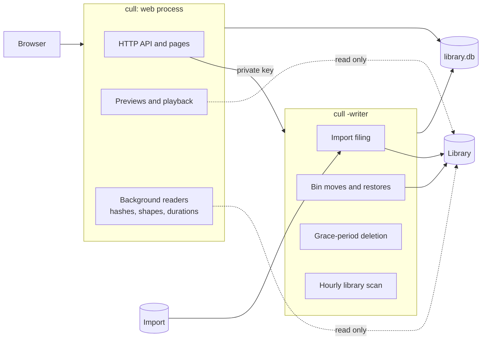

# Architecture

Daddy Cull is one Go binary with a React interface, backed by one SQLite catalogue.
It runs as two processes with different rights: the web process, which only reads the library, and the private writer, the only process that changes it.

## Processes

**The web process** serves the React build, the API and every preview.
It opens library files read-only, through `os.Root`, so a request can never reach outside the library, even through a symlink.
It asks the writer for every change, over HTTP on loopback, with a key only the two processes share (`CULL_BIN_KEY`).

**The writer** does everything that changes the disk:

- It files what arrives in the Import folder under `YYYY/YYYY-MM/YYYY-MM-DD`, every minute, once a file has stopped changing.
- It moves files to the Bin and back, after checking each one's SHA-256 against the plan it was given.
- It deletes what has waited out the Bin's grace period, checking every 15 minutes.
- It scans the library at start and hourly, so files added by hand join the catalogue.

On a Mac both run under launchd, started by `install.sh`.
With `-config`, either process reads its folders from `config.json`, and stops when that file changes, so launchd starts it again with the new setup.
On a server they run as two containers; see [SERVER.md](SERVER.md).

## The catalogue

Everything Daddy Cull knows lives in one SQLite file, `library.db`, with one writer connection and a few bounded readers in WAL mode.

| Tables | What they hold |
|---|---|
| `assets`, `asset_days`, `days` | Every file, where it is, when it was taken, and the day it is filed under |
| `decisions`, `decision_events` | Keep, remove and favourite, with an append-only history that makes every choice reversible |
| `day_progress` | Which dates are reviewed |
| `asset_evidence`, `media_shapes`, `video_durations` | What the background readers learned: MD5 for duplicates, sizes, lengths |
| `file_plans`, `file_state`, `trash_deletions` | What the Bin holds, where each file went, and when it goes for good |
| `asset_arrivals`, `notifications` | What reached the library since a date was last opened |
| `takeout_*` | Google Takeout exports read, and what was added from them |
| `immich_favourites`, `photos_sync` | What was sent to Immich and Apple Photos |
| `tasks`, `task_items` | Long jobs queued from the interface, so a page never waits on them |

Paths are stored under a fixed `/archive/` prefix, and mapped to the library folder when a file is opened.
A `catalogue_generation` counter rises whenever files are added or removed; pages and background readers watch it to know when to look again.

## Background readers

The web process works through the library in the background, one file at a time, so the disk stays free for previews:

- **Hashes.** Every file that shares its size with another is hashed with MD5, until Duplicates can prove which are copies.
- **Shapes.** Each photo's width, height and orientation, so grids are laid out before thumbnails load.
- **Durations.** Each video's length.

Each pass starts within 30 seconds of a catalogue change, and at least every ten minutes.

## Previews

Thumbnails are generated, not stored with the photos, into `preview-cache`, keyed by file, size and modification time.
ffmpeg decodes video frames and HEIC, and exiftool extracts the JPEG a camera embeds in a RAW file, which is much faster than decoding the RAW.
Both are handed an already-opened file rather than a path.
Videos are served with byte ranges, so the browser can seek without downloading the whole file.
A tool that is missing is logged once, and only the previews that need it are unavailable.

## Safety rules

1. The browser sends catalogue IDs, never paths.
2. Nothing is ever overwritten: filing, adding from Takeout and restoring all refuse an existing name.
3. A move checks the file's size and SHA-256 against what the plan expected, and stops on any difference.
4. Removed files go to `.culled` inside the library, on the same disk, and can be restored.
5. Deletion happens only in the writer, only after the grace period set in Settings, and only for files in the Bin.
6. A scan that fails part way marks nothing missing.
7. Apple Photos, Immich and Jellyfin are changed only through their own interfaces, never their databases.

## Addons and the API

Every route is described in `/api/openapi.json`, generated from the code, and shown on the Developers page.
Addons are small web apps that get a key limited to the permissions they ask for; Cull's own features, such as Screenshots and Google Photos, are built-in addons.
[ADDONS.md](ADDONS.md) shows how to write one.
The interface follows changes live through server-sent events at `/api/events`.

## Scale

`go run ./cmd/scale -assets 1000000 -requests 2000 -workers 8` builds a synthetic catalogue of a million files and measures the API against it.
It measures routing, queries and JSON, not disks, decoding or the browser.
