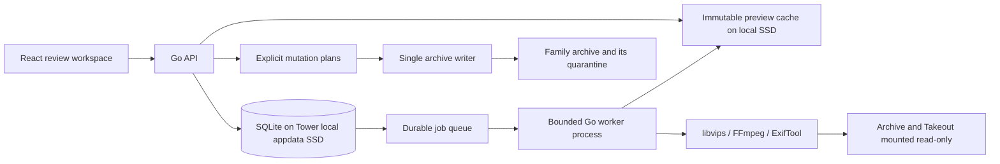

# Daddy, Cull! architecture

## Decision and implementation boundary

Build a single-host Go application with a React/TypeScript interface, SQLite on local SSD, and bounded native media workers.
Deploy on Unraid Tower in Docker alongside the existing PHP app until migration gates pass.
Target hundreds of thousands of media assets, with a one-million-record catalogue benchmark.
An asset-count benchmark does not establish decoding, HDD, network, GPU or browser performance.

Implemented in this directory: an isolated synthetic catalogue, Go HTTP API, indexed cursor pagination, source/media filters, durable review decisions, optimistic concurrency, idempotent retries, decision history, session undo, a bounded React workspace and a reproducible scale harness.
The prototype cannot read, move or delete original media.
It is not a replacement for the deployed app yet.
Real ingestion, native preview workers, matching, durable sessions, crash-recoverable quarantine, imports and consumer handoff are the next implementation gates below.
Do not connect the prototype to production by mounting the old database into it.

## Deployment topology

The API serves the compiled React files; Node is a build dependency only.
Use the same Go binary in separate `serve`, `worker` and eventually `mutator` roles so resource and mount permissions differ.
The API and media worker receive read-only media mounts.
Only the mutator receives archive write access, and it receives no writable Takeout mount.
The mutator is disabled until filesystem recovery tests and a synthetic Docker pilot pass.
No service implements purge, permanent deletion, source cleanup or cloud deletion.
There must be one active writer implementation during cutover; never let PHP and Go execute archive mutations concurrently.

Database and cache live under separate appdata directories, not an SMB share or the archive's FUSE path.
Use a physical local filesystem path for SQLite, with backups because the cache pool may lack redundancy.
Keep the current port 8823 during development; use 8830 for the isolated preview.
Reserve port 8823 for the finished app only after parity, restore and rollback verification.
Production access uses the private network plus authenticated sessions, secure cookies over HTTPS, same-origin mutation checks and no secret-bearing URLs.
The synthetic preview has no media mounts and must not be mistaken for production.

## Why Go and native components

Go coordinates HTTP, cancellation, bounded concurrency and filesystem operations.
SQLite is already native C via the established go-sqlite3 driver.
Use libvips for image resizing and FFmpeg for video previews, contact sheets and browser-compatible proxies.
Retain the existing HDR and orientation handling until verified replacements match it.
Use embedded RAW previews first; add a vetted native RAW decoder only for unsupported cases or true pixel inspection.
ExifTool remains a metadata extractor, not a source of automatic editing instructions.

Invoke native tools with explicit argument arrays, timeouts and bounded output; never shell-interpolate filenames.
Subprocess isolation lets decoder failures leave the API alive.
Constrain worker container memory/CPU/PIDs and the internal codec thread counts, not just Go goroutines.
Hardware decoding is optional and must be verified on Tower for the actual codecs, bit depths and HDR paths.
Custom C or a native Go binding requires a profile showing subprocess overhead is a material cost.
Moving an existing FFmpeg call from PHP to Go does not make its codec faster.

## Catalogue and identity

Use immutable asset IDs independent of paths, file hashes or group membership.
Each asset has a source, source-relative path, fingerprint/version, capture time plus provenance, media kind and processing status.
Sources represent the family archive, extracted Takeout, future imports and their capabilities.
Equal filenames in different sources are not equal assets.
Capture time uncertainty is visible; folder dates and export dates never silently override EXIF.

Keep these concerns separate:

| Entity | Responsibility |
| --- | --- |
| Sources | Root identity, availability, read-only policy, scan generation |
| Assets | Stable identity, source location, version and capture metadata |
| Relationships | Exact copy, equivalent media essence, rendition, RAW companion, Live component or similar capture, with evidence |
| Events | Human-adjustable scene/event grouping independent of physical files |
| Decisions | Keep, later or cull intent; favourite is independent |
| Decision events | Append-only before/after history and request identity |
| Jobs | Persistent priority, attempts, lease, next attempt time and input version |
| Renditions | Immutable derived file keyed by asset version and processing recipe |
| Operation plans | Exact allowed mutation set, expected fingerprints and recovery state |
| Import receipts | Source identity, destination, verification and backup evidence |
| Album memberships | Many-to-many provenance retained even when copies are consolidated |

Indexes follow actual query/filter combinations.
Use `(captured_at, id)` keyset pagination, capped page sizes and indexes prefixed by source/media filters.
Do not use deep OFFSET pagination, return all assets to React or run whole-library counts on each request.
Read connections are bounded; writes use one short-transaction connection with WAL and full synchronous durability for decisions.
Never hold a write transaction while walking directories, decoding or hashing.
SQLite remains suitable until measured writer contention or multi-host requirements justify PostgreSQL.

The current prototype fixes a maximum asset ID for each paginated traversal, excluding later additions.
That is an append boundary, not a fully immutable snapshot under reclassification or capture-time edits.
Production sessions must persist ordered asset IDs and versions, so changing grouping cannot silently change a review session.

## Background work and growing libraries

Walk directories incrementally and upsert metadata in bounded batches.
Use filesystem notifications as hints and periodic reconciliation as the authority.
A failed, interrupted or unavailable-root scan must never mark all unseen files deleted.
Only a successfully completed scan of a verified root may mark missing assets unavailable.
Keep their identity, decisions and provenance for reconciliation.

Jobs are durable rows, not an in-memory channel that loses work on restart.
Claim a bounded batch in a short transaction, assign an expiring lease and renew it while running.
Use a unique key on task type, asset ID, input version and recipe version to deduplicate jobs.
On restart, reclaim expired leases; use capped retries/backoff and a visible failed-job queue.
Publish results only if the input version still matches.
Write to a temporary cache file, validate, then atomically publish the completed rendition.

Prioritise the visible preview, next session, current source intake, then background enrichment.
Apply aging so background work eventually progresses.
Start with one sequential hashing stream per physical spinning disk and one expensive decoder job.
Measure before raising concurrency; many workers can make Unraid random IO slower.
Pause enrichment under disk pressure without interrupting decision saves.
Set a byte quota and eviction policy for disposable previews; never evict originals, decisions or receipts.
Prewarm sessions from the actual unresolved queue rather than tomorrow's anniversary alone.

## Matching and recommendations

Generate candidates using size, capture windows, source identifiers and indexed similarity features.
Do not compare every asset to every other asset.
At one million assets, exhaustive pairwise matching is approximately 500 billion pairs.
Add an approximate-nearest-neighbour index only when measured cross-source candidate generation requires it; it remains a rebuildable derived index.

Verify exact copies using a cryptographic digest and the recorded file version.
Byte equality does not prove external album or sidecar metadata is redundant.
Stream hashes can establish media-essence equivalence, but do not prove all container metadata, audio tracks, edits or provenance are interchangeable.
Perceptual similarity proposes a group; it never authorises removal.
Do not call same-stem files copies, and do not use recycled camera names to establish Live Photo pairing.
Prefer verified content identifiers and validated metadata for component relationships.
Keep RAW+JPEG, original+edit and Live components separate from bursts of distinct captures.
Allow multiple keepers and manual split/merge of suggested scenes.

Only rank quality within a verified comparable set.
Resolution, duration and bitrate are facts, not universal quality scores.
Conflicting strengths, different codecs/HDR characteristics, unique edits or uncertain equivalence require manual review.
Face sharpness and closed-eye assessments remain local suggestions, with reasons and confidence.
A technically imperfect but unique family moment must never be auto-rejected.

## Daily review flow

The home action is Continue review, with a short bounded session and a clear stopping point.
Use event context across folder dates; keep On this day as optional discovery.
Keep, Later and Mark for culling are explicit decisions; Favourite is independent.
Arrow keys browse only; a loading error or unseen group member cannot count as reviewed.
Keep versus Later must be distinguishable when resuming.
Record confirmed decisions before advancing; on uncertain network outcomes retry the same request ID and payload.
Reject stale revisions rather than overwriting a decision from another tab.

Maintain a bounded filmstrip and virtualise larger collections.
Preload only a few upcoming display previews, release unused decoded images, and load native-resolution regions on demand.
Provide pinned-keeper comparison, synchronised pan/zoom, matched face close-ups and a clear component list.
Video review needs contact sheets, duration/audio context, scrubbing and optional synchronised comparison.
Do not mark a video resolved because its poster appeared.
A session summary reports resolved and deferred decisions, not rewards for deleting more.
There is no mandatory keep ratio or punitive streak.
Keyboard focus, readable contrast, reduced motion, mobile touch controls and explicit save failures are release requirements.

## Google Takeout belongs in intake

Register extracted Takeout as a read-only source and include it in the unified catalogue.
Do not copy the whole 400 GB into the canonical archive before review.
For future ZIPs, inventory entries and validate safe extraction paths first; extract unresolved candidates under strict size/count limits.
Preserve album folders and JSON sidecars as provenance, not duplicate media rows to delete blindly.

The Takeout queue has four outcomes:

1. Already represented: show the verified archive counterpart and retain the source receipt and album memberships.
2. Alternative rendition: compare side by side and permit keeping both, especially edits, montages and longer/different videos.
3. Missing memory: offer a verified copy into the archive under a collision-safe name.
4. Uncertain: defer with the unresolved evidence visible.

An import copies to an archive temporary file, flushes, verifies size and digest, publishes without overwriting, then records a durable receipt.
The Takeout source is retained after import.
Reclaiming Takeout storage is a separate future operation requiring current verification, retained metadata and backup/restore evidence.
It is not implemented by culling, a scheduled cleanup or a reject decision.

The 2026-09-06 handover reports 389 GB under `/mnt/cache/takeout-extract`, 133 distinct missing memories and a separate 51-video comparison set under `/mnt/disk1/takeout-upgrades`.
Those are historical leads for a fresh reconciliation, not current deletion authority.
Use the existing audit mappings as candidate evidence; revalidate source/destination content and availability.

## Filesystem mutation safety contract

The prototype stores cull intent only; no physical mutation executor is implemented.
The eventual executor must satisfy every rule below before being enabled:

1. Accept asset IDs and explicit operation plans, never arbitrary paths supplied by the browser.
2. Resolve paths beneath a configured root using traversal-resistant filesystem APIs; reject symlinks, root changes and unsupported file types.
3. Verify expected source identity/version immediately before applying; uncertainty stops the operation.
4. Expand only verified sidecar/component relationships and show the complete affected set before approval.
5. Block a group operation if an unselected dependency would be affected; never infer deletion from a similarity group.
6. Journal intent durably before each filesystem transition, including exact original and quarantine destinations.
7. Never overwrite a destination, including during restore; use an exclusive destination reservation or platform no-replace primitive.
8. Keep quarantine on the same verified filesystem where possible; an unexpected cross-device move fails closed rather than deleting a source after an implicit copy.
9. Use a staged state machine for multi-file groups because filesystem changes and SQLite transactions are not jointly atomic.
10. Recover interrupted work by comparing the journal with both locations; retain ambiguous files and ask for review.
11. Restore is idempotent, preserves sidecars and cannot overwrite a new original with the same name.
12. Permanent deletion is absent from the API, UI and worker vocabulary.

Never call a move atomic merely because `/mnt/user` presents one path; verify Unraid filesystem behaviour explicitly.
Quarantine is recovery, not reclaimed disk space or a backup.
Consumer updates occur after a verified mutation and must not delete from Apple Photos, Google Photos or other upstream systems implicitly.

## Performance gates

These are proposed acceptance budgets, not measured production claims:

| Path | Target |
| --- | --- |
| Catalogue page at one million rows | p95 below 50 ms server-side under eight browsing clients |
| Confirmed decision save | p95 below 100 ms on Tower local SSD |
| Warm next image | below 150 ms, including browser decode |
| Prepared session open | below 1 second on the intended LAN |
| Client collection size | bounded loaded pages and decoded previews, independent of total catalogue |
| Worker pressure | configured CPU/RAM/IO bounds with visible queue lag |

Measure cold and warm runs separately, plus concurrent ingestion, checkpointing, failed decoders and actual HEIC/RAW/HDR/video assets.
Record p50/p95/p99, failures, RSS including native allocations, queue age, cache hit ratio and disk IO.
Do not infer production memory from Go heap statistics, which omit SQLite/native allocations.

## Migration gates

1. Validate the synthetic catalogue, review ledger and UI; retain the baseline benchmark and fixtures.
2. Add read-only inventory import from a consistent legacy database snapshot and read-only source registration.
3. Implement native jobs and real previews; test representative formats against the existing renderer.
4. Implement source matching and Takeout reconciliation with retained album metadata and reviewable evidence.
5. Implement session persistence and all comparison flows, including deferred and unresolved assets.
6. Build the mutation journal in temporary synthetic filesystems, injecting failures at every transition.
7. Run a separate Tower container with synthetic media, verifying restart, resource limits, backup and restore.
8. Approve a small explicit real-archive pilot, then disable legacy mutations before enabling the new writer.
9. Replace the legacy app only after parity and rollback checks; retain the old database and action ledger.

## Sources

- [SQLite query planner](https://www.sqlite.org/queryplanner.html)
- [SQLite WAL and its single-writer model](https://www.sqlite.org/wal.html)
- [Go database connection management](https://go.dev/doc/database/manage-connections)
- [libvips demand-driven processing](https://www.libvips.org/API/8.17/how-it-works.html)
- [FFmpeg options and hardware acceleration](https://ffmpeg.org/ffmpeg.html)
- [React incremental adoption](https://react.dev/learn/add-react-to-an-existing-project)
- [Narrative face close-ups](https://narrative.so/select/the-close-ups-panel)
- [Lightroom comparison](https://helpx.adobe.com/uk/lightroom-classic/desktop/viewing-photos/browse-compare-photos.html)
